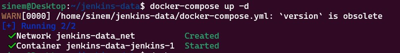
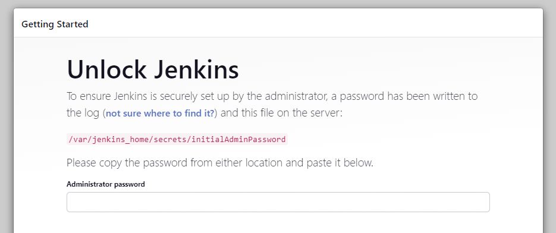
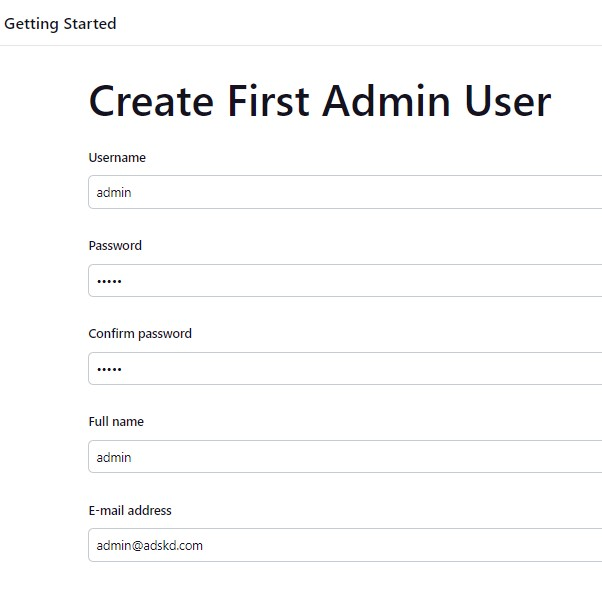
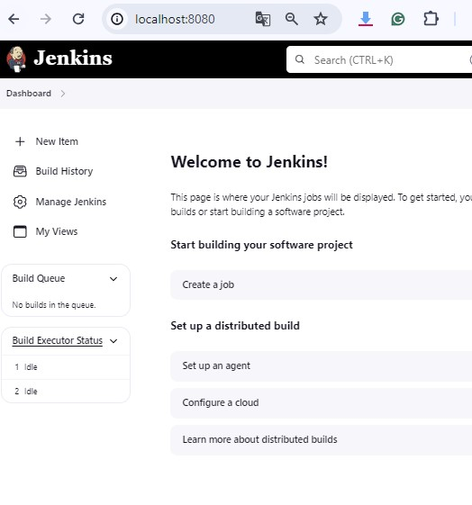

# CREATING JENKINS SERVER WITH DOCKER COMPOSE 

We are going to learn how to run a Jenkins server on a Docker container with Docker-compose.yml file running on Ubuntu 20.04

Steps:
1. Pull Jenkins Images from DockerHub
2. Create Docker-Compose file
3. Build Docker compose file and Get Docker Container
4. Connect to Jenkins server with Browser (localhost)

# Building All The Things 
1. Pull Jenkins Images from DockerHub

```bash
docker pull jenkins/jenkins:lts
```

2. Create Docker-Compose file

- Create `docker-compose.yml` file with `touch`

```bash
touch docker-compose.yml
```

- Edit with `vim` text editor. 

```bash
vim docker-compose.yml
```
- Copy and paste following; 

```yml
version: '3'
services:
  jenkins:
    image: jenkins/jenkins:lts #our image name
    ports:
      - "8080:8080"
    volumes:
      - "$PWD/jenkins_home:/var/jenkins_home" #attach the container volume
    networks:
      - net #connect to network called `net`
networks:
  net: # create a network called `net`
```

3. Build Docker compose file and Get Docker Container

- We will create our Jenkins server with docker-compose command

```bash
docker-compose up -d
```



## Command Breakdown
`docker-compose:` This is the Docker Compose command-line tool used for defining and running multi-container Docker applications.


`up:` This command builds, (re)creates, starts, and attaches to containers for a service.


`-d: `This flag stands for "detached mode," meaning the containers will run in the background.


- Check the container 

```bash
docker ps
```


4. Connect to Jenkins server with Browser (localhost)

- Go to your browser and type `http://localhost:8080.`



# SetUP Jenkins server

- Go to your ubuntu machine CLI and ssh into Jenkins container and find jenkins password


```bash
docker exec 7<<containerid>>  cat /var/jenkins_home/secrets/initialAdminPassword
```


- Create admin account make sure you remember!



# W E L C O M E    TO    J E N K I N S 

